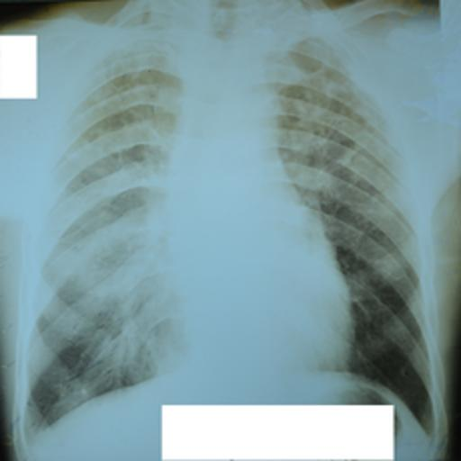
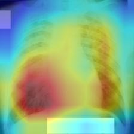
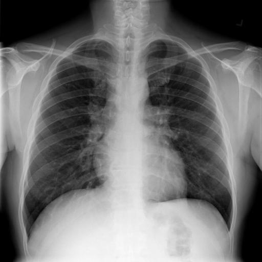

# Safe and Explainable AI
This is an ongoing project where I explore various concepts and methods used
for enuring AI safety, transparency, and interpretability. This repo contains
both notes on AI safety topics as well as code and notebooks applying the 
various AI safety and explainability 

## Model Attribution
### Saliency Methods
- Explored the use of Grad-CAM in Computer Vision Classification for Tuberculosis
using chest X-Rays. See [here](https://github.com/AlexVogt1/Safe-and-Explainable-AI/tree/main/TB)
  - Currently working on benchmarking different vision models
  - Going to add how different pixel augmentation affects model performance and grad-cam output for interpretability.
- X-Ray of person with TB

  |  

- X-ray of person without TB

  | 

## Alignment
- See my masters work on explaining play-style behaviours [here](https://github.com/AlexVogt1/Explaining-player-behaviours)
were use reward-shaping to align agent behaviours to mimic common human behaviour in games

## Fairness and Bais Mitigation
- See `Bias/COMPAS_Racial_bias.ipynb` on analysing racial bias of the COMPAS algorithm used in the US law system

## Safety, Ethics and Governance
- Working through the Introduction and AI Safety, Ethics and Society text book which can be found [here](https://www.aisafetybook.com/)